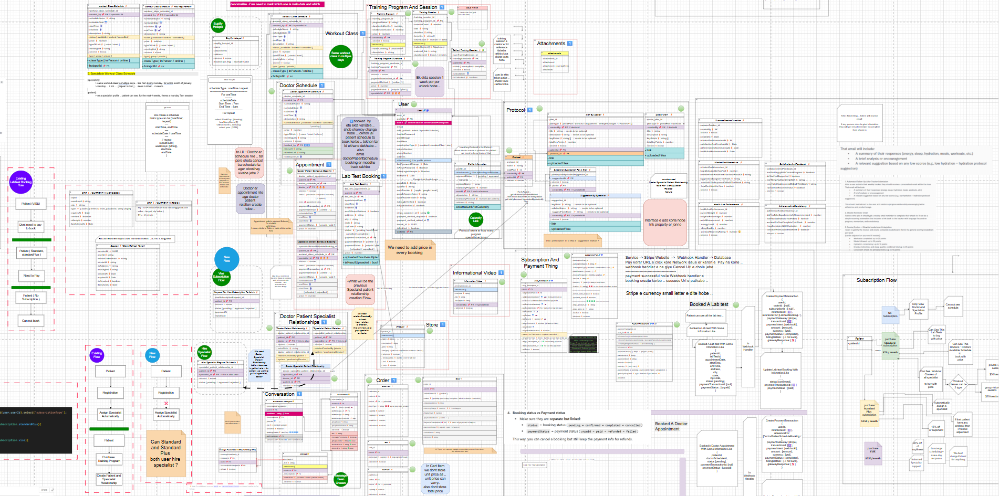
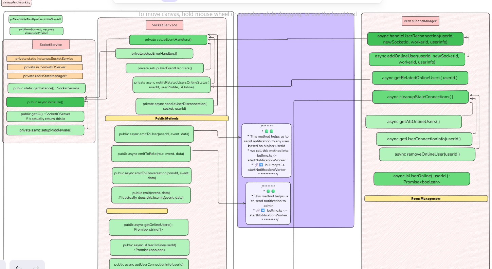

# Suplify Backend

A robust, scalable, and modular backend system built with **Node.js**, **Express**, and **TypeScript**. Suplify is designed for high-performance applications requiring real-time communication, complex background task management, payment integration.




---

## 🚀 Key Features

*   **Modular Architecture**: Built with a focus on maintainability, utilizing inheritance and generic programming patterns for services and controllers.
*   **Real-time Communication**: Integrated **Socket.io** with **Redis** adapter for scalable, real-time messaging and notifications.
*   **Background Processing**: Robust job queuing using **BullMQ** and message streaming with **Kafka**.

*   **Payment Infrastructure**: Full **Stripe** integration for handling subscriptions, payments, and webhooks.
*   **File Management**: Secure file uploads with **Multer** and storage solutions (AWS S3/DigitalOcean Spaces).
*   **Security & Authentication**: JWT-based auth with **Bcrypt**, **Helmet** for security headers, and **Zod** for schema validation.
*   **Observability**: Centralized logging with **Winston** and log rotation.
*   **Localization**: i18n support using **i18next**.

---

## 🛠 Tech Stack

*   **Core**: Node.js, Express, TypeScript
*   **Database**: MongoDB (Mongoose)
*   **Real-time/Cache**: Redis, Socket.io
*   **Background Jobs/Events**: BullMQ, Kafka
*   **Payments**: Stripe
*   **Cloud/Storage**: AWS SDK (S3 / DigitalOcean)
*   **Notifications**: Firebase Admin
*   **AI**: OpenAI
*   **Validation/Security**: Zod, Bcrypt, Helmet, express-rate-limit

---

## 📥 Getting Started

### Prerequisites

*   Node.js (v18+)
*   pnpm
*   Redis instance
*   MongoDB instance

### Installation

1. Clone the repository:
   ```bash
   git clone <repository-url>
   ```

2. Install dependencies:
   ```bash
   pnpm install
   ```

3. Setup environment variables:
   Copy `.env.example` to `.env` and configure the required variables (Database URL, Stripe keys, AWS credentials, etc.).

4. Run the project:
   ```bash
   pnpm run dev
   ```

---

## 📝 Credits

This project was developed by [Mohammad Sheakh](https://github.com/mohammadsheakh).
Based on the TypeScript Backend Boilerplate by [rakib-islam](https://github.com/rakibislam2233).
